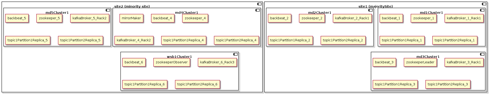
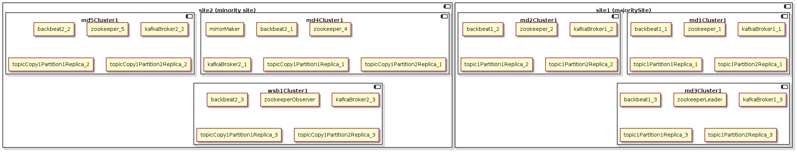
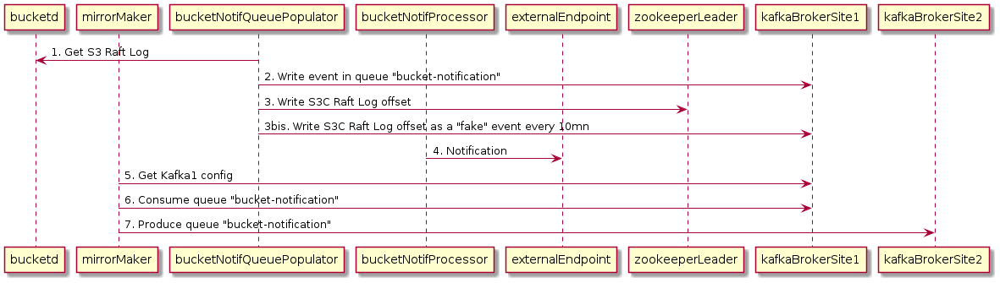

# Backbeat Stretched

## Summary

S3C currently refuses to install backbeat on stretched deployments,
unless the inter-site latency is < 5ms in which case the deployment
can be forced at your own risk with `env_backbeat_allow_multi_site`.

In this design document we try to cover the general case for Backbeat
in stretched scenarios wether it is on 2 or 3 sites regardless the
inter-site latency.

In particular we introduce new components that bring some new
guarantees in term of RPO (Recovery-Point-Objectives) when failing
over and failing back in case of site-loss scenarios.

The emphasis is set on Backbeat workflows that maintain state which
cannot be reconstructed easily (e.g. Bucket Notification).

## Formalization of the Problem

The general issues are related to components maintaing state:

- Metadata
- Redis-sentinel
- Zookeeper
- Kafka

While Metadata and Redis-sentinel being previously addressed, our
focus is on Zookeeper and Kafka.

Zookeeper is known to behave correctly with high latency but will
require a new component called `Zookeeper Observer` for failing over
correctly.

In order to achieve geo-replication, Kafka could be configured with
Replicas, ISR (In-Sync-Replicas) and rack-awareness but if not done
correctly it could dramatically slow down the I/O performance.

### Brief Recall of Kafka Fundamentals

When writing messages into Kafka, we write them into a topic. Topics
contain logically related messages which are divided into a number of
partitions. Partitions serve as our unit or ordering, replication, and
parallelism.

Topics are configured with a replication-factor, which determines the
number of copies of each partition we have. All replicas of a
partition exist on separate brokers (the nodes of the Kafka
cluster). This means that we cannot have more replicas of a partition
than we have nodes in the cluster. The number of replicas in a topic
is specified by the application when creating the topic.

A replica is either the leader of its partition, or a follower of the
leader. A follower can either be in-sync with the leader (contains all
the partition-leader’s messages, except for messages within a small
buffer window), or out-of-sync. The set of all in-sync replicas
(including the partition-leader) is referred to as the ISR (In-Sync
Replicas).

The minimum number of in-sync replicas (`min.insync.replicas` in Kafka
server.properties) specifies how many replicas that are needed to be
available for the producer to allow `acks=all` request (see meaning of
`ack` parameter below). All requests with acks=all won't be processed
and receive an error response if the number of in-sync replicas is
below the configured minimum amount

```
When a producer sets acks to "all" (or "-1"), min.insync.replicas
specifies the minimum number of replicas that must acknowledge a write
for the write to be considered successful. If this minimum cannot be
met, then the producer will raise an exception (either
NotEnoughReplicas or NotEnoughReplicasAfterAppend).  When used
together, min.insync.replicas and acks allow you to enforce greater
durability guarantees. A typical scenario would be to create a topic
with a replication factor of 3, set min.insync.replicas to 2, and
produce with acks of "all". This will ensure that the producer raises
an exception if a majority of replicas do not receive a write.
```

During a broker outage, all partition replicas on the broker become
unavailable, so the affected partitions’ availability is determined by
the existence and status of their other replicas. If a partition has
no additional replicas, the partition becomes unavailable.

If a partition has additional replicas that are in-sync, one of these
in-sync replicas will become the interim partition leader. Finally, if
the partition has addition replicas but none are in-sync, we have a
choice to make: either we choose to wait for the partition leader to
come back online–sacrificing availability — or allow an out-of-sync
replica to become the interim partition leader–sacrificing consistency
(Source: see links below).

When a producer sends a produce request, the conditions for the
request to be considered a success is determined by a producer
configuration parameter called `acks`, which can be set to one of the
following values:

* 0: return success at the moment the request is sent
* 1: return success once the partition leader acknowledges the request
* all: return success once all replicas in the ISR acknowledge the request

There is another Kafka feature called Rack Awareness: Each broker is
configured with a label describing which "rack" (or datacenter) the
broker is within. Then, when Kafka assigns replicas across different
brokers, it spreads the replicas across the available racks.

### How we deploy Backbeat in S3C Today

This is an example of how we currently deploy Backbeat on 5 servers with the following
`group_vars/all` configuration:

```
env_enable_backbeat: yes
env_backbeat_allow_multi_site: yes
env_bucket_notifications:
  enabled: yes
  # set a unique resource name to the destination
  destinations:
    - resource: 'destination1'
      type: 'kafka'
      host: '10.100.6.123:29092'
      topic: 'topic1'
```

Here is for instance a topology:

```
[majority]
md1-cluster1 # store0 broker2
md2-cluster1 # store1 broker3
md3-cluster1 # store2 broker4
[minority]
md4-cluster1 # store3 broker0
md5-cluster1 # store4 broker1
wsb1-cluster1
```

Here is the assignment:

```
# /opt/scality/s3tools/bin/backbeat-topic-info  | grep notif
Topic:backbeat-bucket-notification    PartitionCount:5    ReplicationFactor:3    Configs:max.message.bytes=5000000
    Topic: backbeat-bucket-notification    Partition: 0    Leader: 4    Replicas: 4,3,0    Isr: 3,0,4
    Topic: backbeat-bucket-notification    Partition: 1    Leader: 0    Replicas: 0,4,1    Isr: 1,0,4
    Topic: backbeat-bucket-notification    Partition: 2    Leader: 1    Replicas: 1,0,2    Isr: 2,1,0
    Topic: backbeat-bucket-notification    Partition: 3    Leader: 2    Replicas: 2,1,3    Isr: 2,3,1
    Topic: backbeat-bucket-notification    Partition: 4    Leader: 3    Replicas: 3,2,4    Isr: 2,3,4
```

As we can see the assignment is not rack-aware (partition 4 is totally
on majority site).

As we see we have 5 partitions by default, each having 3 replicas. It
is confusing but on the screenshot the ISR displayed is current state
of the partition, not the configured value which is
`min.insync.replicas=2`.

In S3C we use the default value of `ack=1` which means that the
replicas are not totally synchronously maintained. They are however
potentially very close (messages within the buffer window are not
required to be in-sync).

Note: Setting `0` or `1` can lead to inconsistent partitions
(e.g. message differing for identical offsets if a leader vanishes
temporarily and another leader is elected within the buffer
window). See [Best practices around Kafka consistency and
availability](#best_practices)

Also since we use `keyed partitioning` writers error out when a
partition is not available.

Thanks to the settings above we can tolerate 2 server failures without
failing the writes but we sacrifice consistency (we can have
inconsistencies in topic replicas limited to the buffer window).

We chose that strategy as a trade-off for availability and consistency
assuming inconsistency is very rare due to local proximity of
servers.

Note: The inconsistency shall be checked by the application itself
(e.g. with an anti-entropy algorithm for CRR).

### Specification for Backbeat Stretched

We want to deploy Backbeat stretched correctly and in AZ (availability
zones) scenarios where latency is OK (<5ms).

#### Enabling Kafka Rack Awareness

There are 2 types of backbeat workflows:

1. Replayable workflows, e.g. replication, lifecycle, etc in which we
don't really care losing items in the queue (but we have to check
afterwards regularly with e.g. an anti-entropy mechanism).

2. Non-replayable workflows, e.g. bucket notification, in which we
don't want to lose the queue, to avoid lost/double notifications

For 1. we don't really care about the rack-aware, number of copies in
sync, since it is going to slow the perfomance down.

For 2. we do, but we have only 1 broker per server, so we have to
somehow find the best tradeoff between 1. and 2.  So if we configure
rack-aware, type "1" workflows will benefit from it indirectly.

The problem is that `min.insync.replicas` cannot be set programmatically
for a specific topic.

So one solution for instance is to enable rack-aware and keep
`min.insync.replicas=2` globally. We can keep the existing number of
partitions, replicas, backbeat instances for replication.

We need to properly label the different kafka-brokers (5) with a
`rack` parameter corresponding to the site name: e.g. 3 of them will have
`rack=majority` and the 2 others will have `rack=minority`.
need to enable rack-aware.

A broker config may look like that:

```
broker.id=2
broker.rack=majority
delete.topic.enable=true
advertised.listeners=PLAINTEXT://10.100.7.65:9092
listeners=PLAINTEXT://:9092
zookeeper.connect=...
log.dir=/data
log.retention.hours=168
log.roll.hours=168
unclean.leader.election.enable=false
min.insync.replicas=2
```

Exemple of rack aware assignment:

```
Topic:backbeat-bucket-notification    PartitionCount:5    ReplicationFactor:3    Configs:
    Topic: backbeat-bucket-notification    Partition: 0    Leader: 2    Replicas: 2,1,4    Isr: 2,1,4
    Topic: backbeat-bucket-notification    Partition: 1    Leader: 0    Replicas: 0,4,2    Isr: 0,4,2
    Topic: backbeat-bucket-notification    Partition: 2    Leader: 3    Replicas: 3,0,1    Isr: 3,0,1
    Topic: backbeat-bucket-notification    Partition: 3    Leader: 1    Replicas: 1,3,4    Isr: 1,3,4
    Topic: backbeat-bucket-notification    Partition: 4    Leader: 4    Replicas: 4,1,2    Isr: 4,1,2
```

For bucket notification we may set a replication factor of 4 which
will dispatch 2 copies on 2 sites.

Since we cannot change the `min.insync.replicas=2` there is no
guarantee that the remote copies are in sync (even with ack=all).

However:

* By specifying `ack=1` the current state of the queue would be
  potentially sometimes inconsistent as it is today, but with the
  additional negative effect of the inter-site latency. This is why
  for some critical workflows whose queues cannot reconstructed
  easily, like Bucket Notification, it would be advised to set
  `ack=all`. This setting will have an impact on performance but
  Bucket Notification messages are small.

* For CRR (Cross-Region-Replication) we can keep `ack=1` but we need
  the anti-entropy algorithm to make sure there is no divergence in
  the objects on the source and the target sites.

#### Enabling Kafka Follower Fetching

Before the introduction of this feature, all consume and produce
operations took place on the leader. With Multi-Region Clusters,
clients are allowed to consume from followers. This dramatically
reduces the amount of cross-datacenter traffic between clients and
brokers.

The consumers also need to be configured to talk to the nearest
brokers (same site) otherwise the overall reads can be slow. See [How
to Configure Rack Aware Consumers](#rack_aware_consumer).

In server.properties:
```
replica.selector.class=org.apache.kafka.common.replica.RackAwareReplicaSelector
```

#### Enabling a Zookeeper Observer on the WSB

Although ZooKeeper performs very well by having clients connect
directly to voting members of the ensemble, this architecture makes it
hard to scale out to huge numbers of clients. The problem is that as
we add more voting members, the write performance drops. This is due
to the fact that a write operation requires the agreement of (in
general) at least half the nodes in an ensemble and therefore the cost
of a vote can increase significantly as more voters are added.

A new type of ZooKeeper node has been introduced which is called an
Observer. Observers are non-voting members of an
ensemble which only hear the results of votes, not the agreement
protocol that leads up to them. Other than this simple distinction,
Observers function exactly the same as Followers - clients may connect
to them and send read and write requests to them. Observers forward
these requests to the Leader like Followers do, but they then simply
wait to hear the result of the vote. Because of this, we can increase
the number of Observers as much as we like without harming the
performance of votes.

Setting up a ZooKeeper ensemble that uses Observers is very simple,
and requires just two changes to your config files. Firstly, in the
config file of every node that is to be an Observer, you must place
this line:

```
peerType=observer
```

This line tells ZooKeeper that the server is to be an
Observer. Secondly, in every server config file, you must add
:observer to the server definition line of each Observer. For example:

```
server.1:localhost:2181:3181:observer
```

#### Overview of a Deployment

<!--
@startuml img/backbeat-stretched/overview-rack-aware.png
skinparam BackgroundColor transparent
allow_mixing

component site2 as "site2 (minority site)" {
  component md4Cluster1 {
    agent mirrorMaker
    agent backbeat_4
    agent zookeeper_4
    agent kafkaBroker_4_Rack2
    agent topic1Partition1Replica_4
    agent topic1Partition2Replica_4
  }
  component md5Cluster1 {
    agent backbeat_5
    agent zookeeper_5
    agent kafkaBroker_5_Rack2
    agent topic1Partition1Replica_5
    agent topic1Partition2Replica_5
  }
  component wsb1Cluster1 {
    agent backbeat_6
    agent zookeeperObserver
    agent kafkaBroker_6_Rack3
    agent topic1Partition1Replica_6
    agent topic1Partition2Replica_6    
  }
}

component site1 as "site1 (majoritySite)" {
  component md1Cluster1 {
    agent backbeat_1
    agent zookeeper_1
    agent kafkaBroker_1_Rack1
    agent topic1Partition1Replica_1
    agent topic1Partition2Replica_1
  }
  component md2Cluster1 {
    agent backbeat_2
    agent zookeeper_2
    agent kafkaBroker_2_Rack1
    agent topic1Partition1Replica_2
    agent topic1Partition2Replica_2
  }
  component md3Cluster1 {
    agent backbeat_3
    agent zookeeperLeader
    agent kafkaBroker_3_Rack1
    agent topic1Partition1Replica_3
    agent topic1Partition2Replica_3    
  }
}

@enduml
-->



| Component  | Description |
| ------------- | ------------- |
| backbeat_* | Backbeat instances dispatched on all sites (e.g. `bucketNotifQueuePopulator` and `bucketNotifProcessor`) |
| zookeeper_* | Zookeeper cluster nodes dispatched on all sites (1 per server) |
| kafkaBroker_*_Rack* | Kafka cluster dispatched on all sites with Rack tag (1 per server) |
| zookeeperObserver | Passive node listening to the messages and storing data in the ledger but not participating to the quorum |
| topic1Partition1Replica_* | Replicas of topic 1 partition 1 |
| topic1Partition2Replica_* | Replicas of topic 2 partition 1 |

### Scenarios

#### Fresh Install

A mono-site install shall not enable rack-aware.

A multi-site fresh install shall properly dispatch the replicas on the different sites.

#### Migration from a Non-Rack Aware Environment

Currently the only solution is to stop the backbeat (notification) containers, delete
and recreate the bucket-notification topic, and restart the backbeat
containers.

#### Failover (Temporary Minority Site Loss)

* Remove leader enforcement in Metadata (see Metadata docs).
* Change the bucket-notification topics replication factor to 3
* Change the number of ZK nodes to 3

#### Failover (Temporary Majority Site Loss)

* Metadata specific playbook to promote warm-stand-by
* Need special playbook for promoting the `zookeeperObserver` into a normal node
* Change the number of ZK nodes to 3
* Create a Kafka broker on WSB rack=minority.
* Change the bucket-notification topic replication factor to 3

Note:

* It is possible that we lost the last events in ZK since we cannot enforce leadership.

#### Failback (From Temporary Minority Site Loss)

* Re-enable leader enforcement in Metadata (see Metadata docs).
* Change the bucket-notification topic replication factor back to 4
* Change the number of ZK nodes to 5

#### Failback (From Temporary Majority Site Loss)

* Change the bucket-notification topic replication factor back to 4
* Change the number of ZK nodes to 5
* Re-enable the ZK observer on WSB

## Suggested Changes

In all cases we shall review per workflow queue inconsistency issues: 

* Anti-entropy for CRR since we use `ack=1`.
* No problem with Bucket Notification since we plan to use `ack=all`.
* Upgrading Kafka (e.g. to 2.4.0 for rack-aware consumption).
* Deploy a Zookeeper Observer.
* Tag the kafka-brokers with the rack (site ID).
* Configure the proper replication factor for each topic (e.g. 3 for replication and 4 for bucket notification).
* Modify Backbeat Bucket Notification to use `ack=all`.
* Use the rack aware consumer selector.

### Alternative Solutions for Higher latency scenario (MirrorMaker)

This scenario is rejected for stretched but could still be useful in
high latency scenarios.

This scenario would be for 2 sites.

For this scenario to work we need to deploy 1 kafka cluster of 3 nodes
per site. We can keep the current setting of 3 replicas per partition
and an ISR of 2 (allowing the loss of 2 servers) and `ack=all` without
enabling rack-awareness. The copy on the other site needs to be done
asynchronously with `MirrorMaker`. These settings would guarantee the
constraints and the availability without sacrificing the consistency
and the performance on the active site.

Notes:

* We need `ack=all` for Bucket Notification topic.
* We can keep `ack=1` for CRR topic (coupled with anti-entropy).
* The consistency of the local replicas shall be maintained by each site.
* The consistency of the local and remote queues shall be controlled by the application.
* The restart point of the remote site in case of failover must be controlled by the application.

In case of 3 sites we would need to deploy backbeat stretched on 2
sites to tolerate 1 site failure.

This diagram shows an overview of all the components involved in the solution:

<!--
@startuml img/backbeat-stretched/overview-mirror-maker.png
skinparam BackgroundColor transparent
allow_mixing

component site2 as "site2 (minority site)" {
  component md4Cluster1 {
    agent mirrorMaker
    agent backbeat2_1
    agent zookeeper_4
    agent kafkaBroker2_1
    agent topicCopy1Partition1Replica_1
    agent topicCopy1Partition2Replica_1
  }
  component md5Cluster1 {
    agent backbeat2_2
    agent zookeeper_5
    agent kafkaBroker2_2
    agent topicCopy1Partition1Replica_2
    agent topicCopy1Partition2Replica_2        
  }
  component wsb1Cluster1 {
    agent backbeat2_3
    agent zookeeperObserver
    agent kafkaBroker2_3
    agent topicCopy1Partition1Replica_3
    agent topicCopy1Partition2Replica_3    
  }
}

component site1 as "site1 (majoritySite)" {
  component md1Cluster1 {
    agent backbeat1_1
    agent zookeeper_1
    agent kafkaBroker1_1
    agent topic1Partition1Replica_1
    agent topic1Partition2Replica_1    
  }
  component md2Cluster1 {
    agent backbeat1_2
    agent zookeeper_2
    agent kafkaBroker1_2
    agent topic1Partition1Replica_2
    agent topic1Partition2Replica_2    
  }
  component md3Cluster1 {
    agent backbeat1_3
    agent zookeeperLeader
    agent kafkaBroker1_3
    agent topic1Partition1Replica_3
    agent topic1Partition2Replica_3        
  }
}

@enduml
-->



| Component  | Description |
| ------------- | ------------- |
| backbeat1_* | Backbeat instances on site 1 (e.g. `bucketNotifQueuePopulator` and `bucketNotifProcessor`) |
| backbeat2_* | Backbeat instances on site 2 (e.g. `bucketNotifQueuePopulator` and `bucketNotifProcessor`) |
| zookeeper_* | Zookeeper cluster nodes dispatched on all sites (1 per server) |
| kafkaBroker1_* | Kafka cluster nodes serving partitions on site 1 (1 per server) |
| kafkaBroker2_* | Kafka cluster nodes serving partitions on site 2 (1 per server) |
| zookeeperObserver | Passive node listening to the messages and storing data in the ledger but not participating to the quorum |
| mirrorMaker | Special consumer to copy from 1 kafka cluster to another |
| topic1Partition1Replica_* | Replicas of topic 1 partition 1 |
| topic1Partition1Replica_* | Replicas of topic 1 partition 2 |
| topicCopy1Partition1Replica_* | Copy of replicas of topic 1 partition 1 |
| topicCopy1Partition1Replica_* | Copy of replicas of topic 1 partition 2 |

Sequence:

<!--
@startuml img/backbeat-stretched/dynamic-overview-mirror-maker.png
skinparam BackgroundColor transparent

participant bucketd
participant mirrorMaker
participant bucketNotifQueuePopulator
participant bucketNotifProcessor
participant externalEndpoint
participant zookeeperLeader
participant kafkaBrokerSite1
participant kafkaBrokerSite2

bucketNotifQueuePopulator -> bucketd : 1. Get S3 Raft Log
bucketNotifQueuePopulator -> kafkaBrokerSite1 : 2. Write event in queue "bucket-notification"
bucketNotifQueuePopulator -> zookeeperLeader : 3. Write S3C Raft Log offset
bucketNotifQueuePopulator -> kafkaBrokerSite1 : 3bis. Write S3C Raft Log offset as a "fake" event every 10mn
bucketNotifProcessor -> externalEndpoint : 4. Notification
mirrorMaker -> kafkaBrokerSite1 : 5. Get Kafka1 config
mirrorMaker -> kafkaBrokerSite1 : 6. Consume queue "bucket-notification"
mirrorMaker -> kafkaBrokerSite2 : 7. Produce queue "bucket-notification"

@enduml
-->



| Step  | Description |
| ------------- | ------------- |
| 1. Get S3 Raft Log | Bucket Notification get the S3 Raft Log messages|
| 2. Write event in queue | Bucket Notification writes the events in the topic|
| 3. Write S3C Raft Log offset | The Queue Populator records the current S3 Raft log offsets.
| 3bis. Write S3C Raft Log Offset as a "fake" event | Periodically record the state of S3C raft log offsets in the topic as a "fake" event for safe failover restart|
| 4. Notification | Notification to the external endpoint |
| 5. Get Kafka1 config | MirrorMaker needs the config of the site1 kafka broker |
| 6. Consume | Read the topic |
| 7. Produce | Write the events in the second site kafka broker |

Note that since Zookeeper is stretched all S3 Raft log offsets are
correct everywhere (almost). The problem is to recover from a site failure.

Things that we would have to do with MirrorMaker:

2 sites:

* Deploy 2 different active Kafka clusters on the 2 sites
* Deploy active MirrorMaker on the 2 sites
* Force applications to use the majority site brokers.
* Deploy a Zookeeper Observer
* Modify BucketNotif to write "fake" offset events.
* Playbooks for failover and failback (changing Kafka broker endpoints, resetting S3 Raft log offsets)

3 sites: deploy at least 2 sites.

## Additional Links

* <a name="best_practices"></a>[Best practices around Kafka consistency and availability](https://blog.hiya.com/hiyas-best-practices-around-kafka-consistency-and-availability)
* <a name="rack_aware_consumer"></a>[Consuming messages from closest replica](https://docs.confluent.io/platform/current/multi-dc-deployments/multi-region.html)
* [Kafka acks explained](https://betterprogramming.pub/kafka-acks-explained-c0515b3b707e)
* [MirrorMaker](https://cwiki.apache.org/confluence/pages/viewpage.action?pageId=27846330)
