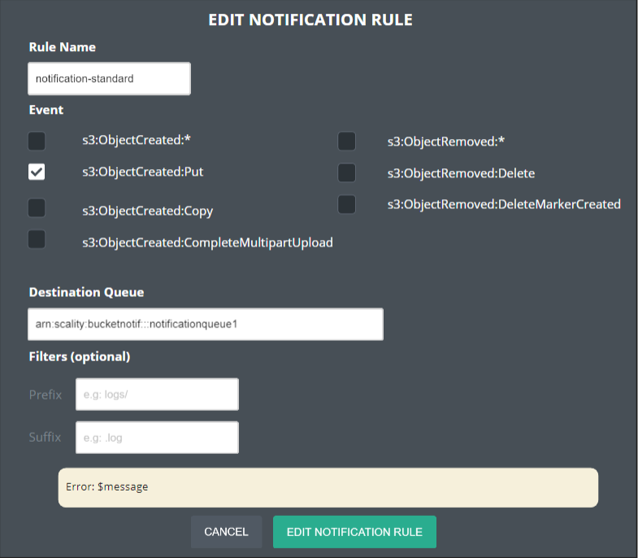

# Bucket Notification

The bucket notification feature enables an external application to
receive notifications when certain events happen in a bucket.

The API part of the feature will be built in line with the AWS
specification while the notification delivery system will be specific
to our solution, and will permit the delivery through a variety of
mediums (e.g. RabbitMQ, Kafka, etc).

We plan to leverage the
[Backbeat](https://github.com/scality/backbeat) component to perform
the collection of events from the S3C Raft oplog (and later on from
MongoDB oplog), the queuing and the delivery of events.

The feature has to be implemented mainly for S3C and eventually be
implemented for Zenko and Blobserver.

## Requirements

## Use-cases Description

## API

The `PutBucketNotificationConfiguration` API will store the bucket
configuration in a post-processed way (XML converted to JSON) into the
`metastore` special database.

The structure of a BucketNotificationConfiguration payload looks like
the one defined in the [AWS
spec](https://docs.aws.amazon.com/AmazonS3/latest/API/API_PutBucketNotificationConfiguration.html)
but is slightly different:

In the AWS spec it is possible to specify:

* TopicConfiguration: for notifying an event (SNS)
* QueueConfiguration: for queueing an event (SQS)
* CloudFunctionConfiguration: for executing a cloud function (Lambda)

We plan to only support `QueueConfiguration` for now.  For each
`QueueConfiguration` there are 4 types of items:

* `Id`: a unique user defined ID or automatically generated.
* `Event`: the type of event.
* Optional `Filter`: define specific sub-filter rules for objects such as `prefix` and `suffix`. If not defined it will generate an event for all objects.
* `QueueArn`: the ARN of the target (see thereafter).

Example of a notification configuration (for a given bucket):

```
<NotificationConfiguration>
     <QueueConfiguration>
         <Id>MyFilterSet1</Id>
         <Event>s3:ObjectCreated:*</Event>
         <QueueArn>arn:scality:bucketnotif:::target1</QueueArn>
    </QueueConfiguration>
    <QueueConfiguration>
         <Id>MyFilterSet2</Id>
         <Event>s3:ObjectCreated:*</Event>
         <Filter>
             <S3Key>
                 <FilterRule>
                     <Name>prefix</Name>
                     <Value>images</Value>
                 </FilterRule>
                 <FilterRule>
                     <Name>suffix</Name>
                     <Value>.jpg</Value>
              </FilterRule>
            </S3Key>
        </Filter>
        <QueueArn>arn:scality:bucketnotif:::target2</QueueArn>
    </QueueConfiguration>
</NotificationConfiguration>
```

Event types that will need to support:

Event | Description
------|------------
`s3:ObjectCreated:*`, `s3:ObjectCreated:Put`, `s3:ObjectCreated:Copy`, `s3:ObjectCreated:CompleteMultipartUpload` | Will generate an event respectively every time an object is created (whatever the operation type), written, copied, MPU constituted.
`s3:ObjectRemoved:*`, `s3:ObjectRemoved:Delete`, `s3:ObjectRemoved:DeleteMarkerCreated` | Will generate an event respectively every time an object is deleted (whatever the operation type), deleted, or a delete marker is created.

Event types that will need to support eventually (in future releases):

Event | Description
------|------------
`s3:ObjectCreated:Post` |  Will generate an event every time an object is created.
`s3:ObjectRestore:Post`, `s3:ObjectRestore:Completed`| Will generate an event when an object will be restored from an archival storage (e.g. tape, or Glacier)
`s3:Replication:OperationFailedReplication`, `s3:Replication:OperationMissedThreshold`, `s3:Replication:OperationReplicatedAfterThreshold`, `s3:Replication:OperationNotTracked` | Specific replication related events.

Since it will be exhausting to redefine the entire SQS API, we define
our own ARN format for the targets (`QueueArn`) that will map directly
to static config:

```
arn:partition:service:region:account-id:resource
```

With the following ARN mapping:

* `partition` being hardcoded `scality`.
* `service` being harcoded `bucketnotif`.
* `region` being ignored.
* `account-id` being ignored.
* `resource` being the name of the static target name (see below).

In S3C the targets will be specified directly in the `group_vars/all` as YAML definitions, e.g.:

```
env_bucket_notifications:
  - resource: target1
    type: rabbitmq
    host: <somehost>
    port: <someport>
    auth:
    - user: <user>
      password: <password>
  - resource: target2
    type: kafka
    host: <somehost>
    port:
    auth:
    - cert: certificate path
```

For the first version of the service we store the secrets in the configuration.

In Zenko the targets will be defined in ConfigMaps and Secrets.

Both Cloudserver and Backbeat need to be aware of the targets configurations.

## Technical Details

### Cloudserver Changes

In the `PutBucketNotificationConfiguration` API, Cloudserver must
check that the ARN points to a valid target.

Arsenal needs to be modified to store the operation that generated the
event in the ObjectMD structure. For this a new field `originOp` will
be added in ObjectMD. E.g. it may be structured like this: `originOp:
copy`, `originOp: delete`. We so far stick to the AWS event name
specification as it is broad enough (we may later extend it for more
granularity).

### Backbeat Changes

A specific database oplog consumer (here Metadata oplog, but later
MongoDB oplog) will filter out the metadata operations according to
the filters defined in the bucket configuration, interpret the
`originOp` field and queue the operations in a specific Backbeat topic
`bucket-notification`.

The bucket notification queue populator will live in its own pod.  We
plan to use the LogReader class in Backbeat to build the bucket
notification S3C oplog reader. We plan to leverage this class since it
already abstracts the different oplogs mechanisms in a unified
interface. There could be slight changes into the LogReader class as
it used to be meant for the QueuePopulationExtension mechanism that we
are going to deprecate.

```
+---------+
|Metadata/|
|MongoDB  |                      +-----------+
+------+--+                      |Replication|
       | oplog                   |Processor  |
       |                         +----+------+
       |       +---+pod+-------+      |        +-+pod+------+    +-----------------+
       +------>+Bucket notif   |   +--v---+    |Bucket notif|    |external endpoint|
               |queue populator+-->+Topic +<---+Processor   +--->+Kafka, RabbitMQ  |
               +------+--------+   +------+    +----+-------+    +-----------------+
                      |       filter                |       refilter
                      |                             |
                      |          +----------        |
                      +---------->Zookeeper+<-------+
                    target       +---------+    read
                    config                      config
```

Note that in order to support `s3:replication` related events we will
need to have the replication processor directly writing events in the
Bucket Notification Topic.

Having each service (Replication, Ingestion, Bucket notification,
Workflow engine, etc) in its own pod allows better separation of
concerns in term of: configuring, scaling, restarting the services.

#### Dynamic Filters Configuration

The Bucket notification queue populator will get the current
FilterRules directly from the `metastore` related oplog events,
indiscriminately for the initial discovery and for the dynamic changes
(FilterRules added or removed).

Note: For S3C listening to all the `metastore` oplog events is
scalable because it has its own raft session and we don't expect to
have too many entries. In the case of Zenko, we may have to do an
initial discovery directly into the `metastore` bucket, and then the
oplog is rotated so we expect it to be relativelty fast to process.

For each NotificationConfiguration detected we will update a specific
Zookeeper entry in the path
`/com/scality/backbeat/bucket-notification`.
E.g. `/com/scality/backbeat/bucket-notification/<BucketName>/MyFilterSet1`
where `BucketName` is the name of the bucket, `MyFilterSet` is the
unique id defined in the `QueueConfiguration`. The file will contain
all the filter rules and the target in JSON format.

#### Bucket Notification Queue Populator: Event Processing

Each time the Bucket notification queue populator will match an event
in the oplog according to the active set of filters, it will create an
entry in the Bucket Notification topic. For sake of disk space we
only have one global topic for the service, will only record the
bucket name, object name and type of event (and strip out the metadata
of the object).

The bucket notification processor will have to do a refilter (see next
section) to avoid tagging the entries. This also have the advantage of
having the processor reflecting immediately the dynamic configuration
changes and not having a "lag".

Notes for buckets formats and versioning: For versioned buckets we
need to ignore the master since there are always 2 updates in a
batch. We also need to properly manage buckets where versioned has
been disabled. We also need to manage the new bucket format, by
potentially skipping the prefix.

#### Bucket Notification Processor: Actions

The bucket notification processor will adapt dynamically to bucket
notification configuration changes (added / deleted filter rules) by
setting a watcher on the bucket notification Zookeeper path.

Each target will have its own processor on the topic, consume at its
own pace, skip entries which do not match and produce in its external
endpoint. Parallelism will be achieved by having consumer groups.

Note: When delivering events to the external Kafka for instance, we
need to be aware that the acknowledgment arrives in the delivery
report event and not in the callback of the message. To manage this
problem we can leverage the OffsetLedger class as it has been used in
the replication mechanism. Retries can be done in memory and
persistence is done when acknowledging offsets in the commit. Note
that a message can be delivered more than once but this is not a
problem since the goal is to deliver the message at least once.

#### Pause & Resume

TBD

#### Monitoring & Metrics

TBD

## UI

The S3 Browser UI needs to be adapted to this new feature, and should target the following user story:

> As a Data Consumer, I want to configure a set of rules to publish notification
> messages in my queuing systems when activity occurs on a bucket so that
> I can monitor data-changes within that particular buckets.

The main change will occurs in the View Bucket Info Modal. Three tabs will be
added:

*   **Overview** will provide a summary of the bucket configuration.
*   **Object Lock** will provide the ability to configure Object Lock feature.
*   **Notification** will provide the ability to configure Bucket Notification
  feature.

### Overview Tab


Acceptance Criteria:
*   The overview tab shall contain the old **Overview** section, and the
  **Permissions** section.
*   The old **Overview** section name shall be replaced by **Properties**.

### Object Lock Tab


Acceptance Criteria:
*   The Notification tab shall contain the old **Object Lock Default Settings**
  section.
*   The old **Object Lock Default Settings** section name shall be replaced by
  **Default Settings**.

### Notification Tab


Acceptance criteria:
*   The bucket notification configuration must be retrieved and displayed
  according to the [GetBucketNotificationConfiguration](https://docs.aws.amazon.com/AmazonS3/latest/API/API_GetBucketNotificationConfiguration.html) action.
*   Clicking **ADD NOTIFICATION** button opens [add notification modal](#add-and-edit-notification-modal).
*   Clicking **Edit** button opens [edit notification modal](#add-and-edit-notification-modal).
*   Clicking **DELETE** button shall delete all selected rules from the bucket
  notification using [PutBucketNotificationConfiguration](https://docs.aws.amazon.com/AmazonS3/latest/API/API_PutBucketNotificationConfiguration.html)
  action.

### Add and Edit Notification Modal




Acceptance criteria:
*   Pressing the tab key must switch the focus between fields.
*   If `s3:ObjectCreated:*` event is selected, then `s3:ObjectCreated:Put`,
  `s3:ObjectCreated:Post`, `s3:ObjectCreated:Copy`, and
  `s3:ObjectCreated:CompleteMultipartUpload` events can't be checked.
*   If `s3:ObjectRemoved:*` event is selected, then `s3:ObjectRemoved:Delete`,
   and `s3:ObjectRemoved:DeleteMarkerCreated` events can't be checked.
*   Clicking **ADD NOTIFICATION RULE** and **EDIT NOTIFICATION RULE** shall
  update the bucket notification configuration according to inputs using [PutBucketNotificationConfiguration](https://docs.aws.amazon.com/AmazonS3/latest/API/API_PutBucketNotificationConfiguration.html) action.

### Alternatives

We could have leveraged tabs on the main pages to avoid modal, and provide
a better UX. But, the development cost of that change is not compatible with
our deadlines, and the S3 Browser will be replaced by XDM UI offline in 2021.

### List of Improvements

*   Suggest the ARNs during the bucket notification configuration.
*   Provide the ability to create the destination queues.

## Alternatives

We could have leveraged the QueuePopulatorExtension mechanism but we
decided not to. This mechanism relies on the idea that having multiple
extensions querying the same oplog will overload the source metadata
engine (as this kind of problems appeared especially on S3C repds).

```
+---------+     +---pod--------+
|Metadata/|oplog|QueuePopulator|
|MongoDB  +---->+              |
+---------+     +--------------+    +------------+       +---pod------+
                |QueuePopulator|    |Replication |       |Replication | replication
                |Extension 1   +---->Topic       <-------+Processor   +------------->
                |Replication   |    |(w/ attr)   |       |(Consumer)  |
                +--------------+    +------------+       +------------+
                |Workflow      |
                |Engine Queue  |    +------------+       +---pod----+
                |Populator     +--->+Workflow    |       |Workflow  | actions
                +----------+---+    |(uuid)      <-------+engine    +------------>
                           ^        |(w/ attr or |       |processor |
                           |        |w/o attr)   |       +-+--------+
                           |        +------------+         |
                           |                               |
                           |   set filter descriptors (ZK) |
                           +-------------------------------+
```

But those load issues have been fixed on S3C so far. The oplog
management have been correctly abstracted in a class in Backbeat so we
think it is better to benefit from a clean separation of concerns.

We think that the concept of QueuePopulatorExtension leads to more
complex designs (for the workflow engine we had to invent a complex
way to reconfigure the filters without restarting the replication
queue populator).

We also noticed that the ingestion mechanism lives in its own pod but
still uses the queuePopulatorExtension mechanism by itself, leading to
a code which is unnecessarily complex. So later on we plan to simplify
this code. Same for the Workflow engine queue populator that could
also live in its pod in using the LogReader classes directly. We also
plan to remove the QueuePopulatorExtension from the code.
