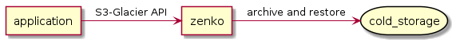
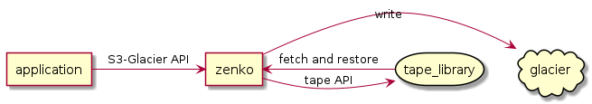
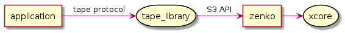
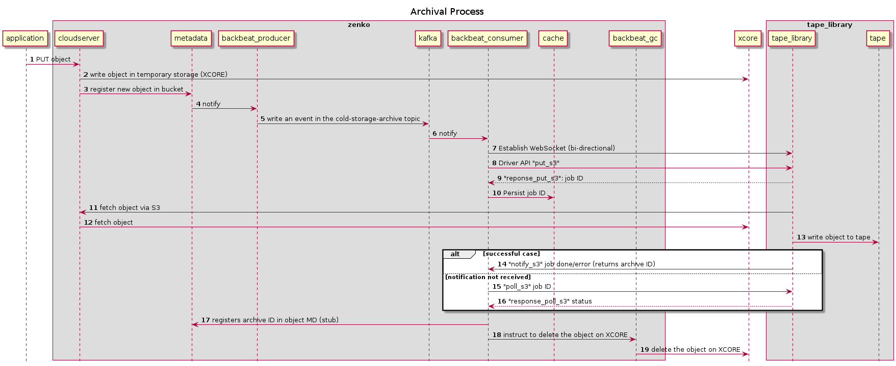
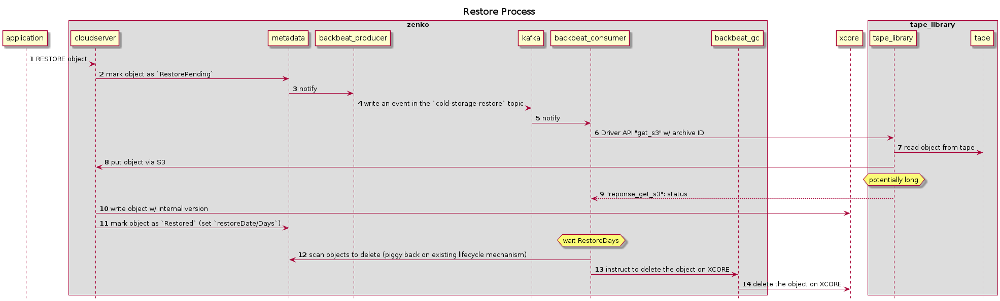

# Cold Storage

The cold storage feature enables an application to select objects to
be sent/retrieved to/from cold storage in using the "S3-Glacier"
semantics.

The API part of the feature will be built in line with the AWS storage
class / Restore specification in regard to object statuses while the
archive constitution will be specific to our solution, and will permit
the delivery through a variety of mediums (e.g. Glacier, DMF,
StrongLink, SpectraLogic, etc).

We plan to leverage the
[Backbeat](https://github.com/scality/backbeat) component to perform
the upload and restore of objects in batches and maintain the object
statuses.

The feature has to be implemented mainly for XDM and Artesca.

<!--
@startuml img/cold-storage/overview.png
skinparam BackgroundColor transparent
allow_mixing

agent application
agent zenko
storage cold_storage

application -> zenko : S3-Glacier API
zenko -> cold_storage : archive and restore

@enduml
-->



| Component  | Description |
| ------------- | ------------- |
| application | Any application that uses S3 Glacier API |
| zenko | The component that we describe in this spec |
| cold_storage | A cloud based cold storage service or a tape library |

## Types of Cold Storage Backends

We roughly classify the cold storage backends in the following way:

### Category 1

In this category a custom API provides the following functionalities:

* Archive batch of objects (or single): For each object, the name, the
  size and the sub-location (storage class) is provided, and return an
  archive ID for each object or a failure status.

* Restore batch of objects (or single) identified by their archive IDs

* Possibility of polling the archive status of a single object.

Data can be transfered through a custom API or through a temporary
storage location using an s3 client (to an S3 bucket) or an NFS client
(to an NFS share). Temporary storage may or may not be local.

Preferably the object data will be directly fetched in-situ by the tape
library (e.g. through direct S3 calls, as long as proper credentials
are given), and restored in situ.

That architecture is ideal because:

* it is 100% user space, scalable and works great with containers (no
special interaction with the platform: no cumbersome PV, no kernel
module, etc)

* We manage the state/stubbing ourselves, and there is no scenario
where for instance the object is marked as archived but in fact is
still in the tape library temporary storage.

Examples in this category: Glacier, DMF, Spectralogic

<!--
@startuml img/cold-storage/overview-category-1.png
skinparam BackgroundColor transparent
allow_mixing

agent application
agent zenko
cloud glacier
storage tape_library

application -> zenko : S3-Glacier API
zenko -> glacier : write
zenko -> tape_library : tape API
tape_library -> zenko : fetch and restore

@enduml
-->



| Component  | Description |
| ------------- | ------------- |
| application | Any application that uses S3 Glacier API |
| zenko | The component that we describe in this spec |
| glacier | A cloud based cold storage service |
| tape_library | A tape library |

### Category 2

In this category data is transfered through a POSIX file system,
exposed by the gateway. Archived data is indexed through stubs in the
filesystem.

The problems of this category are:

* We generally need to mount a proprietary file system to access the
  data, which is not always possible in a container environment (no
  way of loading proprietary kernel modules).

* The tape library file system namespace is permanent and ever growing
  so some scalability issues may occur.

* The decision of archiving is done by the HSM (Hierarchical Storage
  Management) FS itself and therefore out-of-control.

* Restore blocks the read and is slow

<!--
@startuml img/cold-storage/overview-category-2.png
skinparam BackgroundColor transparent
allow_mixing

agent application
agent zenko
storage file_system
storage tape_library

application -> zenko : S3-Glacier API
zenko -> file_system : write through NFS mountpoint
file_system -> tape_library : fetch and restore - stub files

@enduml
-->


| Component  | Description |
| ------------- | ------------- |
| application | Any application that uses S3 Glacier API |
| zenko | The component that we describe in this spec |
| file_system | An HSM file system that controls the archival |
| tape_library | A tape library |

### Category 3

In this category the tape libraries of category 2 exposing their data
through an object interface in front.

Problems:

* It has the same problems as category 2. Especially lack of control on the archival/restore process.

<!--
@startuml img/cold-storage/overview-category-3.png
skinparam BackgroundColor transparent
allow_mixing

agent application
agent zenko
agent s3_gateway
storage file_system
storage tape_library

application -> zenko : S3-Glacier API
zenko -> s3_gateway : S3 protocol
s3_gateway -> file_system : write through local mountpoint
file_system -> tape_library : fetch and restore - stub files

@enduml
-->


| Component  | Description |
| ------------- | ------------- |
| application | Any application that uses S3 Glacier API |
| zenko | The component that we describe in this spec |
| s3_gateway | An S3 compatible interface on top of a file system |
| file_system | An HSM file system that controls the archival |
| tape_library | A tape library |


### Category 4

In this category the tape libraries that support an "S3-Glacier" type
object storage interface.  They totally manage the lifecycle of the
object through the S3 API and the 2 commands "restore" and "archive").

Example of tape libraries: Fujifilm Object Archive.

This very specification aims to define a Category 4 object storage
interface.

Note:

* This architecture is good for a tape library vendor to expose an S3
  compactible interface. But in our case it adds an additional layer
  (impedance) between zenko and the cold storage.

<!--
@startuml img/cold-storage/overview-category-4.png
skinparam BackgroundColor transparent
allow_mixing

agent application
agent zenko
agent s3_interface
agent 3rd_party_machinery
storage tape_library

application -> zenko : S3-Glacier API
zenko -> s3_interface : S3-Glacier API
s3_interface -> 3rd_party_machinery
3rd_party_machinery -> tape_library : queue, fetch and restore

@enduml
-->


| Component  | Description |
| ------------- | ------------- |
| application | Any application that uses S3 Glacier API |
| zenko | The component that we describe in this spec |
| s3_interface | An S3 compatible gateway on top of a file system |
| 3rd_party_machinery | A 3rd party machinery to queue / archive and restore |
| tape_library | A tape library |

### Category 5

In this category tape libraries capable of archiving into an S3
compatible storage. But in such a case we would be the target and it
is out of scope.

<!--
@startuml img/cold-storage/overview-category-5.png
skinparam BackgroundColor transparent
allow_mixing

agent application
agent zenko
storage tape_library
storage xcore

application -> tape_library : tape protocol
tape_library -> zenko : S3 API
zenko -> xcore

@enduml
-->



| Component  | Description |
| ------------- | ------------- |
| application | Any application that uses S3 Glacier API |
| zenko | The component that we describe in this spec |
| tape_library | A tape library |
| xcore | Scality XCORE |

## Requirements

## Use-cases Description

## API

### PUT Object

We must support putting an object directly in a cold storage class.

A fallback storage class which will be configured in the cold storage
location will be used for direct PUTs.

### Lifecycle

The Lifecycle Backbeat task will change the storage class of an object
to a cold storage class.

### RestoreObject

Restore an object which is archived.

The object is restore for `days`
parameters unless `OutputLocation` is specified.

This operation performs 2 types
of requests:

#### Restore an Archive

Restore an archived object.
#### Select

Perform a select query on an archived object of type CSV or JSON.

Not supported right now.

#### More Info

https://docs.aws.amazon.com/AmazonS3/latest/API/API_RestoreObject.html

### HEAD Object

Indicate the status of the retrieval (in progress or restored) thanks
to the special `x-amz-restore` header.

E.g.:
```
...
x-amz-restore: ongoing-request="false", expiry-date="Fri, 23 Dec 2012 00:00:00 GMT"
...
```

https://docs.aws.amazon.com/AmazonS3/latest/API/API_HeadObject.html

### Get Object

If the object retrieved is in a cold storage class (e.g. on tape), a
RestoreObject must be sent before retrieving it. Otherwise, this
operation returns an `InvalidObjectStateError` error.

We need to manage the special `x-amz-restore` header to indicate the
status of the retrieval.

https://docs.aws.amazon.com/AmazonS3/latest/API/API_GetObject.html

## Technical Details

The following spec describes how we interact with tape libraries of
category 1.

### Location Config

Cold storage properties are extended with private parameters like
other storage locations. The `type` of storage location implies a
hidden `isColdStorage=true` property.

```
$ cat locationConfig.json
{
    "us-east-1": {
        "type": "file",
        "objectId": "us-east-1",
        "legacyAwsBehavior": true,
        "details": {}
    },
    "my-tape-1": {
        "type": "tape_library_x",
        "objectId": "my-tape-1",
        "archiveLimits: {
          maxDurationSeconds: 3600,
          maxNumObjects: 1000,
          maxSize: 100000000
        }
        "details": {
           "tape_library_x": {
              "parameters": "LTOx2"
           }
        }
    },        
    "my-glacier-1": {
        "type": "glacier",
        "objectId": "my-glacier-1",
        "archiveLimits: {
          maxDurationSeconds: 3600,
          maxNumObjects: 100,
          maxSize: 100000000
        }
        "details": {
           "glacier": {
              "Vault": "my-vault"
           }
        }
    },
...
```

Storage locations types marked as `isColdStorage=true` will have the following
limitations/properties:

* Impossibility to create a bucket on those locations
* Objects can be created/lifecycled/restored

The bucket storage location will be used for direct PUTs in the cold
storage location (staging). While waiting to the real archiving to
kick in. Note: This is a workaround until we redefine the concept of
storage classes in Zenko. Once we have proper storage classes we could
define transient storage classes.

Some other `archiveLimits` sub-object will be specified (see
explanation below).

Each backend will have specifics in the `details` sub-object (here
Glacier: the vault name)

### Cold-Storage Topics

When putting an object in a cold storage location, either by direct
PUT or by Lifecycle the object location will change.

A specific Backbeat extension producer will monitor the oplog and
detect the cold storage locations (not yet marked as `ArchivePending`
or other related statuses) and create the corresponding objects
entries (bucket, key, version, location, sub-location) into the
`cold-storage-archive` topic, while updating its metadata with the
`ArchivePending` status.

A specific Backbeat extension consumer for each type of supported
backend (matched by location) will monitor the archive topic and watch
for limits to be reached.

#### Limits

Entries in the archive topic are checked for the following limits:

* Duration (maxDurationSeconds)
* Number of objects (maxNumObjects)
* Total size of objects contained (maxSize)

Depending on the type of cold storage backend (push, pull,
capabilitie, etc) the limits will be interpreted differently.

They could be interpreted as a rolling window, e.g. the backend
extension monitoring a window of in-flight objects matching the above
defined limits. Especially if the backend processes objects
one-by-one.

It could also be interpreted as a batch size if the backend prefers
batch processing (e.g. Glacier).

#### Example of Pull Cold Storage Backbeat Consumer Extension

In the pull model the tape library will fetch the data at the source
at its own pace (within some tunable time limit).

Once on object (or a batch) is candidate for being sent to the cold
storage, a job description is sent to the cold storage with a custom
API (e.g. as a JSON or XML document). This document might contain:

* Temporary credentials to read the S3 data at the source

* Full key of the object (bucket + name + version).

* Size of the object. This information is very important for tape
  libraries in general because of the need to anticipate the packing
  in the media. Providing the size here prevents the cold storage
  backend to do an additional operation (e.g. HEAD) to retrieve the
  size.

* Tape specific parameters: e.g. used for managing various replications levels, or
  type of tapes, etc.

Immediately after the cold storage backend shall return a job ID which
is persisted in a best effort manner (e.g. in Redis). It is best not
to lose the job ID but it is no big deal if it is lost.

The tape library will read the various objects defined by the jobs and
pack them / consume them according to their size.

When a job is done, a notification will be sent containing the archive
ID or a failure status.

On success, the archive ID is stored in the metadata of the objects
and the content of the object is marked for deletion in th Backbeat GC
(Garbage Collect) service.

On failure, the object is retried in a new job. After a configurable
number of failures the object is marked as `ArchiveFailed`.

If the notification has not been received after some time
(configurable), the Backbeat consumer extension will perform an active
polling of the various missing objects with a special API.

<!--
@startuml img/cold-storage/category-1-pull-archive.png
skinparam BackgroundColor transparent
autonumber
hide footbox

title Archival Process

participant application order 10
box zenko
participant cloudserver order 20
participant metadata order 30
participant backbeat_producer order 40
participant kafka order 45
participant backbeat_consumer order 50
participant cache order 55
participant backbeat_gc order 60
end box
participant xcore order 70
box tape_library
participant tape_library order 90
participant tape order 100
end box

application -> cloudserver : PUT object
cloudserver -> xcore : write object in temporary storage (XCORE)
cloudserver -> metadata : register new object in bucket
metadata -> backbeat_producer : notify
backbeat_producer -> kafka : write an event in the cold-storage-archive topic
kafka -> backbeat_consumer : notify
backbeat_consumer -> tape_library : Establish WebSocket (bi-directional)
backbeat_consumer -> tape_library : Driver API "put_s3"
tape_library -[dotted]-> backbeat_consumer : "reponse_put_s3": job ID
backbeat_consumer -> cache : Persist job ID
tape_library -> cloudserver : fetch object via S3
cloudserver -> xcore : fetch object
tape_library -> tape : write object to tape
alt successful case
tape_library -> backbeat_consumer : "notify_s3" job done/error (returns archive ID)
else notification not received
backbeat_consumer -> tape_library : "poll_s3" job ID
tape_library -[dotted]-> backbeat_consumer : "response_poll_s3" status
end
backbeat_consumer -> metadata : registers archive ID in object MD (stub)
backbeat_consumer -> backbeat_gc : instruct to delete the object on XCORE
backbeat_gc -> xcore : delete the object on XCORE

@enduml
-->



Note:

* Archival through lifecycle would be similar but triggered by a
  lifecyle rule rather than by metadata.

#### Example of Push Cold Storage Backbeat Consumer Extension

In the push model, e.g. the Glacier Backbeat extension, the data is
directly sent to Glacier and a batch is stored entirely in a Glacier
vault.

### Restoration

When restoring an object from an archive location, the object status
will be marked as `RestorePending`.

The cold storage Backbeat extension will monitor the oplog to detect
the status change and put the object in a special
`cold-storage-restore` topic. A specific Backbeat extension consumer
for the specific cold-storage backend will be used to restore the
data.

Typically the archive ID for the object is provided.

A restore operation may take a very long time (e.g. 10h).

We use internal versioning to distinguish objects internally.

<!--
@startuml img/cold-storage/category-1-pull-restore.png
skinparam BackgroundColor transparent
autonumber
hide footbox

title Restore Process

participant application order 10
box zenko
participant cloudserver order 20
participant metadata order 30
participant backbeat_producer order 40
participant kafka order 50
participant backbeat_consumer order 60
participant backbeat_gc order 65
end box
participant xcore order 70
box tape_library
participant tape_library order 90
participant tape order 100
end box

application -> cloudserver : RESTORE object
cloudserver -> metadata : mark object as `RestorePending`
metadata -> backbeat_producer : notify
backbeat_producer -> kafka : write an event in the `cold-storage-restore` topic
kafka -> backbeat_consumer : notify
backbeat_consumer -> tape_library : Driver API "get_s3" w/ archive ID
tape_library -> tape : read object from tape
tape_library -> cloudserver : put object via S3
hnote over tape_library : potentially long
tape_library -[dotted]-> backbeat_consumer : "reponse_get_s3": status
cloudserver -> xcore : write object w/ internal version
cloudserver -> metadata : mark object as `Restored` (set `restoreDate/Days`)
hnote over backbeat_consumer : wait RestoreDays
backbeat_consumer -> metadata : scan objects to delete (piggy back on existing lifecycle mechanism)
backbeat_consumer -> backbeat_gc : instruct to delete the object on XCORE
backbeat_gc -> xcore : delete the object on XCORE

@enduml
-->



### Tape Library Driver API

This is an example of a driver API which has to be implemented by the tape library:

There are 3 actors:

1. The tape library specific `backbeat_consumer` on zenko which is a "driver API" client.

2. The `tape_library` endpoint to server "driver API" requests.

3. Cloudserver to serve I/O requests.

Some notes:

* A web socket is established from the `backbeat_consumer` for notifications.

* I/O done to the S3 endpoint must be done with MPU for big objects.

Description of a put request and response:

```
{
	"method": "put_s3",
	"data": {
		"url": "https://test.scality.com/bucket1/object1?versionId=qtJlDTD",
		"accessKey": "accessKey1",
		"secretKey": "verySecretKey1",
		"parameters": "LTOx2",
		"size": 201333823
	}
}
{
	"method": "response_put_s3",
	"data": {
		"jobId": "1cad5968-a93d-11eb-8d98-1bf961d3ccb8",
	}
}
```

Description of a notification:

```
{
	"method": "notify_s3",
	"data": {
		"jobId": "1cad5968-a93d-11eb-8d98-1bf961d3ccb8"
       		"status": "Success|Failure"
                "archiveId": "252a8cde-a940-11eb-b186-0718a574b940"
	}
}
```

Note: The `archiveId` is only returned in case of success.

Description of a poll (in case of notification not received):

```
{
	"method": "poll_s3",
	"data": {
		"jobId": "1cad5968-a93d-11eb-8d98-1bf961d3ccb8"
	}
}
{
	"method": "response_poll_s3",
	"data": {
		"status": "Success|Failure|Pending"
                "archiveId": "252a8cde-a940-11eb-b186-0718a574b940"
	}
}
```

Note: The `archiveId` is only returned in case of success.

Description of a get request and response:

```
{
	"method": "get_s3",
	"data": {
		"url": "https://test.scality.com/bucket1/object1?versionId=qtJlDTD",
		"accessKey": "accessKey1",
		"secretKey": "verySecretKey1",
		"parameters": "LTOx2",
	}
}
{
	"method": "response_get_s3",
	"data": {
		"status": "Success|Failure"
	}
}
```


### ObjectMD (Arsenal) Changes

We plan to add a sub-object to maintain the proper object status:

```
...
archive: {
  status: ArchivePending|Archived|RestorePending|Restored|ArchiveFailed
  archiveStorageLocation: XXX
  archiveId: XXX
  restoreDate: XXX
  restoreDays: XXX
}
...
```

If the object restore is in progress.

### Cloudserver Changes

* Mark objects are ArchivePending, or RestorePending.

* A special behind-the-scene non-intrusive S3 PUT operation to restore
  a specific object version for the backbeat extension.

### Backbeat Changes

* Multiple Backbeat extensions (one per supported cold storage
  backend) reading the `cold-storage-archive` and
  `cold-storage-restore` topics containing the list of objects to
  archive/restore.

* Maintain proper objects status in the metadata database.

* Generic sliding window library.

* Maintain job IDs in Redis.

### Pause & Resume

TBD

### Monitoring & Metrics

TBD

## UI

TBD

### Open Questions

#### Interaction with Object Lock

TBD

#### Interaction with Encryption

TBD

## Alternatives

We did not want to use CRR + S3-Glacier to manage the Glacier access
but manage it ourselves. Indeed it is easier to manage the status of
objects (ArchivePending, RestorePending) without ambiguity.

Also constituting archive batches is something we can do generically.
We just have to call the proper tape libraries (Glacier, StrongLink,
SpectraLogic, etc).
