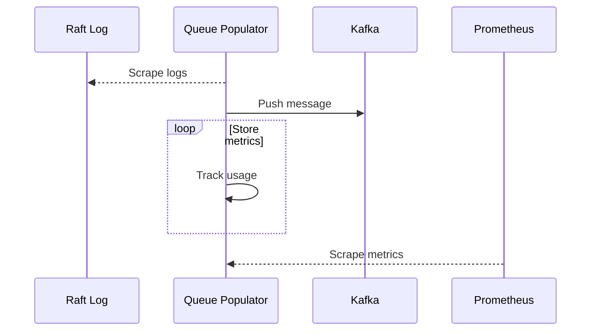
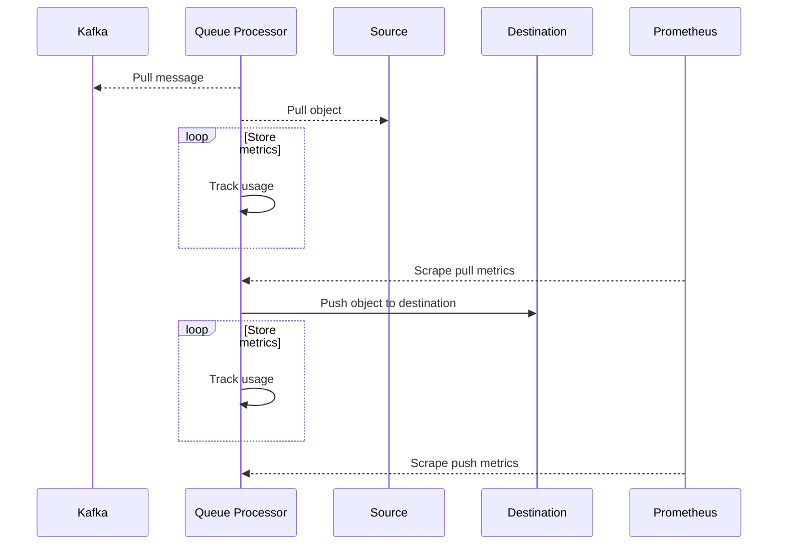
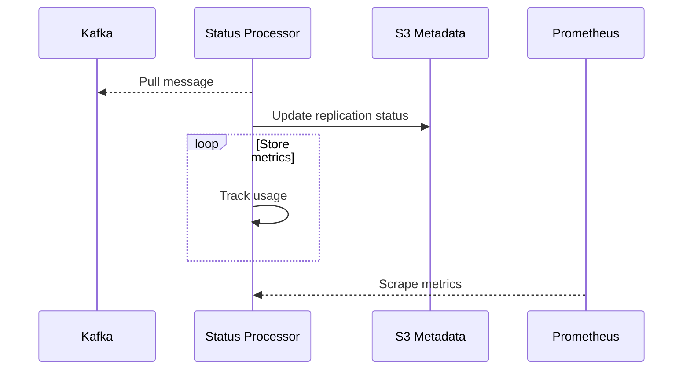

# CRR Metrics

## Queue Populator

### Flow

### Metrics

| Name | Help | Type |
| ---- | ---- | ---- |
replication_read_offset | Current read offset of metadata journal | Gauge
replication_log_size | Current size of metadata journal | Gauge
replication_queued_objects | Total objects queued for replication | Counter
replication_queued_bytes | Total number of bytes queued for replication not including metadata | Counter
kafka_messages_produced | Total number of kafka messages produced by the queue processor | Counter

### Labels

| Name | Description |
| ---- | ----------- |
serviceName | Name of the service where metrics are coming from, used to distinguish general metrics
origin | What method began the action we are doing
logName | What type of log reader we are reading from
logId | Unique ID of the log reader such as the raft ID.
containerName | Name of the docker container
publishStatus | Status of publishing a kafka message

## Queue Processor

### Flow

### Metrics

| Name | Help | Type |
| ---- | ---- | ---- |
replication_processed_objects | Number of objects replicated | Counter
replication_processed_bytes | Number of bytes replicated not including metadata | Counter
replication_processor_elapsed_seconds | Replication jobs elapsed time in seconds | Histogram
kafka_messages_consumed | Total number of kakfa messages consumed by the queue processor | Counter
kafka_messages_produced | Total number of kafka messages produced by the queue processor | Counter
kafka_lag | Number of kafka objects we are behind in the queue | Gauge
http_outgoing_bandwidth | How much outgoing HTTP bandwidth are we using | Gauge

### Labels

| Name | Description |
| ---- | ----------- |
serviceName | Name of the service where metrics are coming from, used to distinguish general metrics
origin | What method began the action we are doing
containerName | Name of the docker container
publishStatus | Status of publishing a kafka message

## Status Processor

### Flow

### Metrics

| Name | Help | Type |
| ---- | ---- | ---- |
replication_objects_status_changed | Number of objects updated | Counter
kafka_lag | Number of kafka objects we are behind in the queue | Gauge

### Labels

| Name | Description |
| ---- | ----------- |
serviceName | Name of the service where metrics are coming from, used to distinguish general metrics
origin | What method began the action we are doing
logName | What type of log reader we are reading from
logId | Unique ID of the log reader such as the raft ID.
containerName | Name of the docker container
replicationStatus | Result of the replication process; success, retry, or failed

## Global Dashboard

### Metrics

### Labels
