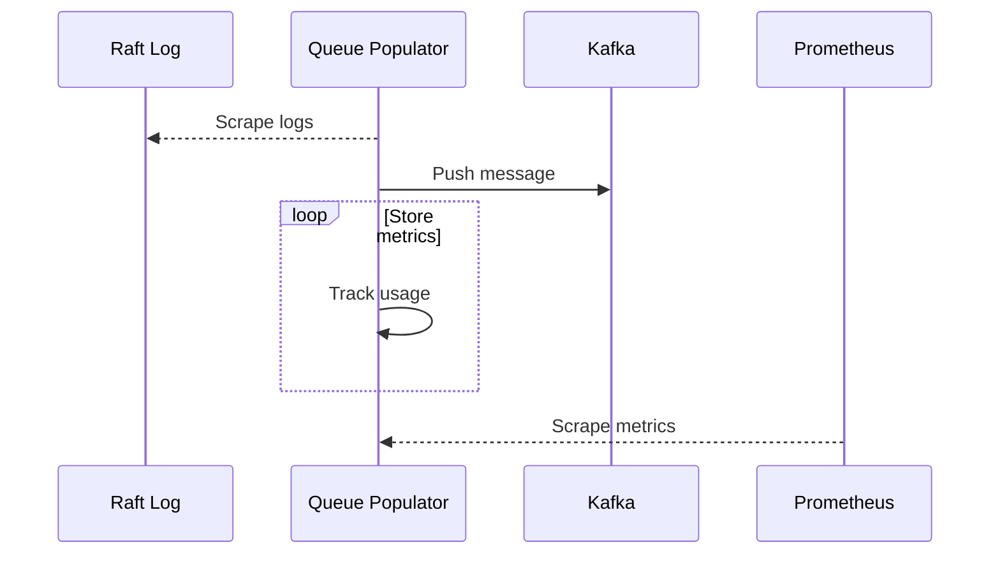
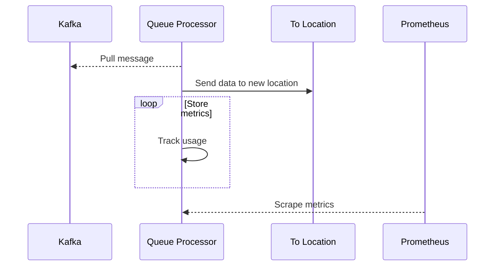

# CRR Metrics

## Populator Flow

## Processor Flow

## Metrics
| Name | Help | Type |
| ---- | ---- | ---- |
replication_populator_messages | Total number of kakfa messages produced by the queue populator | Counter
replication_populator_objects | Total objects queued for replication | Counter
replication_populator_bytes | Total number of bytes queued for replication not including metadata | Counter
replication_processor_messages | Total number of kakfa messages consumed by the queue processor | Counter
replication_processor_objects | Number of objects replicated | Counter
replication_processor_bytes | Number of bytes replicated not including metadata | Counter
replication_processor_elapsed_seconds | Replication jobs elapsed time in seconds | Histogram

The difference between processor objects and queued objects is the current number of waiting objects.
The difference between processor bytes and queued bytes is the current amount of bytes waiting to replicate.

## Labels
| Name | Description |
| ---- | ----------- |
origin | "lifecycle"
raftId | Which raft logs the populator is connected to
partition | Which Kafka partition the event comes from or is going to
sourceLocation | Which location our data replication is coming from, part of configuration
sourceLocationType | Type of location our replication is coming from, such as AWS or Memory
destinationLocation | Which location our data replication is going to, part of configuration
destinationLocationType | Type of location our replication is going to, such as AWS or Memory
status | Kafka execution status
contentLengthRange | Range of sizes of content the request falls into, such as 10MB to 30MB
