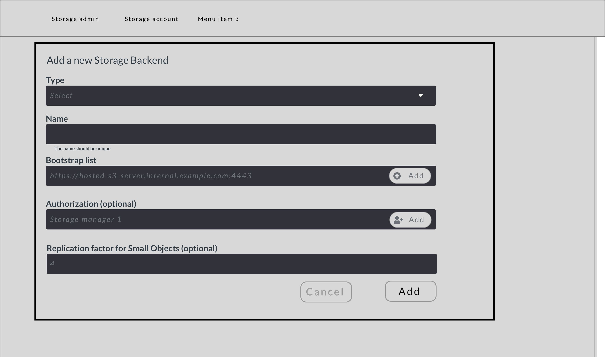

# Zenko UI requirements
## Add a Storage Backend
### User stories
TBC

### Screen

### Display
- is a modal

### Button
- button CANCEL close the modal
- button ADD perform a set of tests to ensure the health of the connectivity between the Zenko Solution Instance and the Backend.
  If the set of tests is expected to takes more than 2 seconds, display a loader icon.
  If the result of the set of tests is `error`:
  - the reason message must be displayed within the modal
  If the result of the set of tests is `success`:
  - the modal must be closed
  - a success message must be display to the Storage Administrator
  - the focus must be the newly created backend card.

### Field
Order|Field|List value|Default value|Exemple value|Frontend check|Mandatory|Helper|Comments
---|---|---|---|---|---|---|---|---
1|Type|TBC according to Glossary|TBC|`Select`|N/A|yes|TBD according to Glossary definition|- must be extract from Moonshot Glossary|
2|Name|N/A|`$backendType-$incr`|N/A|- must be unique - number of character TBD by the developer|yes|will be used by the Solution Instance to identify the backend within the UI|- must be unique - must be suggested|
3.1|Endpoint|N/A|N/A|`https://s3.scality.com/`|- must a URL or an IP|yes|||
3.2|Booststrap list|N/A|N/A|`10.0.0.1`|- must be an IP|yes||- is a list|
4|Authorization|N/A|N/A|`Storage Manager`|- must exist in the system|no||- is a list - can allow the Storage Administrator to allow a Storage Manager to access the created backend - must be auto-completed by the UI|
5.1|Enforced replication factor for small object|N/A|N/A|`3`|- must be an integer|no|If not defined, sproxyd default configuration will be used|- the example should be retrieve through sproxyd API using bootstrap list IP previouly entered

## Browse a Storage Backend
### Screen

