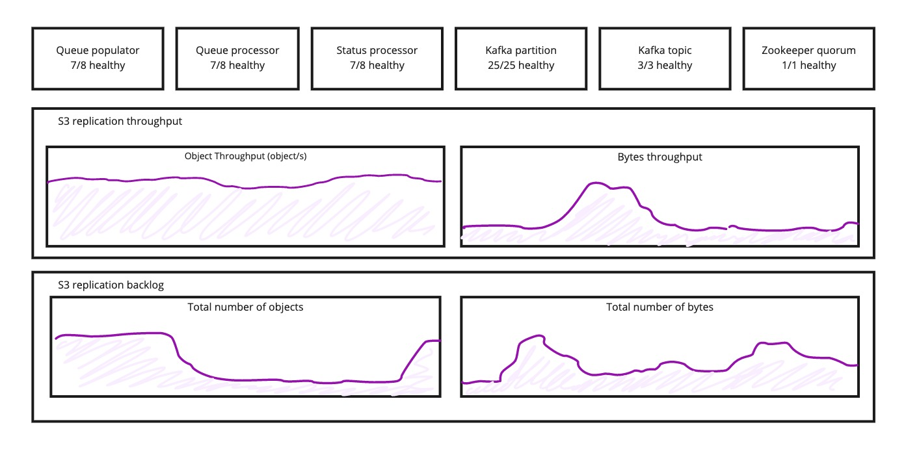
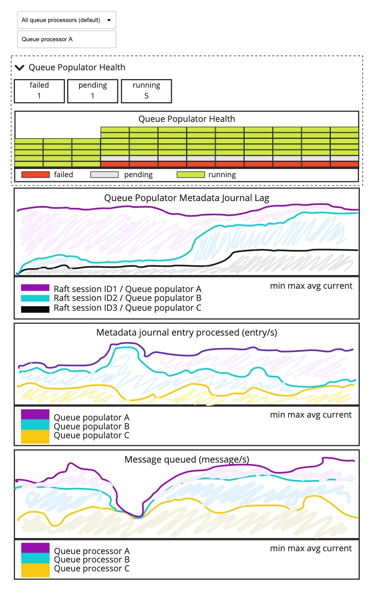
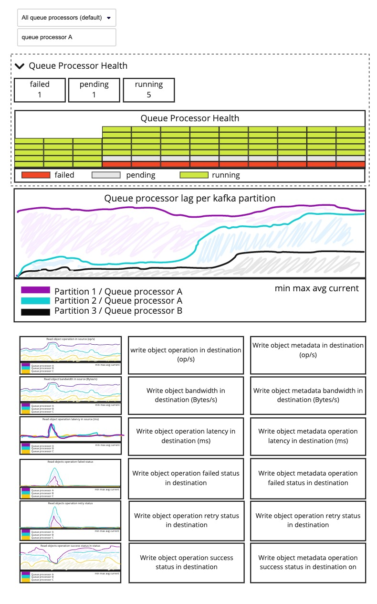
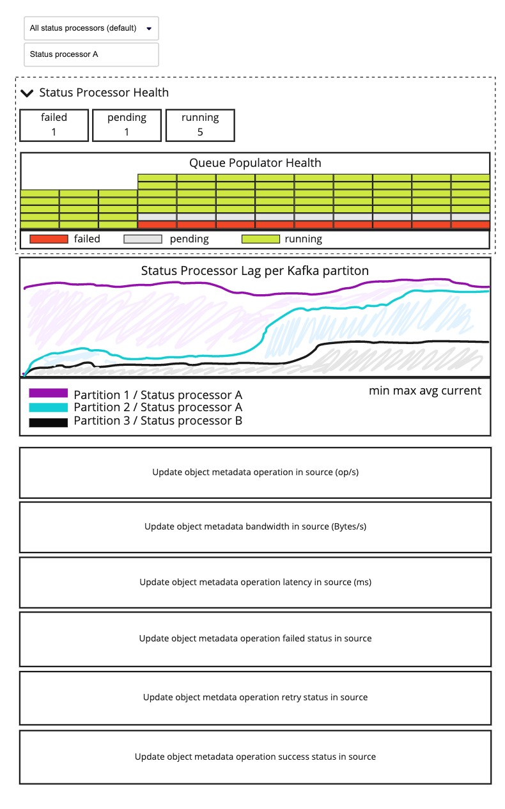

# S3 Replication Monitoring

This document describes S3 Replication monitoring requirements.

## Context

S3 replication enables asynchronous object replication between
a source and a destination bucket. These buckets can be located in the same region
or in different regions.

The Storage Administrator and the Storage Account Owner roles monitor
the replication service from two points of view (PoV):

- S3 replication service provider PoV
- S3 replication service client PoV

### Storage Administrator Monitoring

Storage Administrators are responsible for operating the Scality platform. They
monitor the status and performance of the components that deliver the replication
service.

### Storage Account Owner Monitoring

The Storage account owner is responsible for configuring replication rules for an
S3 client application, monitoring the replication service to make sure a replication
rule meets the application requirements.

## S3 Replication Components Definition

The S3 replication components are:

- Queue Populator
- Queue Processor
- Status Processor
- Kafka brokers (third-party)
- Kafka topics (third-party)
- Kafka partitions (third-party)
- Zookeeper quorum (third-party)

## Storage Administrator User Stories

**As a** Storage Administrator

**I want** a Monitoring Dashboard for S3 replication components

**So that** I can identify configuration, performance, or network issues

### Global Acceptance Criteria

#### API

- S3 replication components metrics must be exposed through HTTP endpoint
  following Prometheus standards
  
#### UI
  
- Third-party components dashboard must have an open-source monitoring dashboard
- S3 monitoring graphs should not show S3 replication operations
- S3 replication service must have a global monitoring dashboard containing:
  - Current number of healthy vs unhealthy S3 replication components
  - Number of objects replicated in the destinations over time
  - Number of bytes replicated in the destinations over time
  - Number of objects in the replication backlog over time
  - Number of bytes in the replication backlog over time

#### Alerting

The product must allow to seed default alerting rules related to replication metrics.

#### Deployment

Replication monitoring components and monitoring dashboards must be deployed
automatically in the product.

#### Documentation

Product documentation must describe:

- Network flows required to monitor S3 replication components (source, port destination,
  and protocol used)
- S3 replication monitoring configuration steps
- S3 replication components metrics
- S3 replication monitoring dashboards
- Alerting definition

### Queue Populator Acceptance Criteria

#### Queue Populator Monitoring API

The **Queue Populator** must expose the following metrics:

- State (running, initializing, or failed)
- Raft session metadata journal read offset
- Raft session metadata journal size
- Number of metadata journal entries processed since startup
- Number of Kafka messages produced on the topic since startup

The Queue Populator metrics must be filterable by:

- Raft session ID
- Host name
- Docker container name

#### Queue Populator Monitoring UI

The **Queue Populator** must have the following monitoring graphs:

- Number of Queue Processor
- State
- Metadata journal lag
- Metadata journal entry processed
- Messaged queued

### Queue Processor Acceptance Criteria

#### Queue Processor Monitoring API

The **Queue Processor** must expose the following metrics:

- State (running, idle, initializing, or failed)
- Kafka consumer offset in the Kafka partitions
- Offset of the last message produced in the Kafka partitions
- Number of messages consumed in the Kafka partitions since startup
- Operations generated to retrieve (GET) objects from the source
  since startup:
  - Number of operation
  - Status
  - Average latency
  - Total bandwidth consumed
- Operations generated to write (PUT) object data and metadata in the destination
  since startup:
  - Number of operation
  - Status
  - Average latency
  - Total bandwidth consumed

Queue Processor metrics must be filterable by:

- Kafka partition ID
- Host name
- Docker container name

#### Queue Processor Monitoring UI

The **Queue Processor** must have the following monitoring graphs:

- Number of Queue Processor
- State
- Partition lag
- Operations generated to retrieve (GET) objects on the source
  - Number of operation
  - Operation status (success, retry, failed)
  - Average latency
  - Total bandwidth consumed
- Operations generated to write (PUT) object data and metadata in the destination
  - Number of operation
  - Operation status (success, retry, failed)
  - Average latency
  - Total bandwidth consumed

### Status Processor Acceptance Criteria

#### Status Processor Monitoring API

The **Status Processor** must exposed the following metrics:

- State (running, idle, initializing, or failed)
- Kafka consumer offset in the Kafka partitions
- Operations generated to update objects metadata in the source since startup
  - Number of operation
  - Status
  - Average latency
  - Total bandwidth consumed
  
The Status Processor metrics must be filtrable by:

- Kafka partition ID
- Host Name
- Docker container name

#### Status Processor Monitoring UI

The **Status Processor** must have the following monitoring graphs:

- Number of Status Processor
- State
- Partitions lag
- Operations generated to update objects metadata in the source
  - Number of operation
  - Operation status (success, retry, failed)
  - Average latency
  - Total bandwidth consumed

